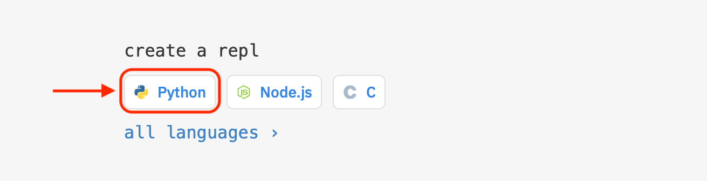
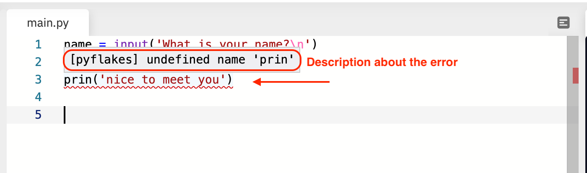

# Integrated Development Environment (IDE)

{: .no_toc }

## Table of contents

{: .no_toc .text-delta }

1. TOC
   {:toc}

---

When you start to learn to program, one important thing to understand is that, "**it's an interactive process**". Software developers continuously iterate and evaluate their code using different methods & tools to archive the desired goal faster.

For example, while learning to sketch designers iteratively use different kinds of sheets of paper, pencils and colour to achieve the desired goal fast with more accurate results.

So what kind of tool software developers use to archive their goal?:

It's called **Integrated Development Environment (IDE)**. It combines different functionalities in one single tool.

Software Developers use this to:

- **Write code** which requires a text editor. It's an intelligent text editor that can understand the fundamentals of different programming languages. So that it can support the developer by highlighting syntax errors or making suggestions in the code they have written. For example, MS Word provides similar support for English. i.e. highlighting grammar error or suggesting to auto-complete the date of the day.
- **Organise code into several files**, which requires fast and structured access to files so that the developer can switch from one to another.
- **Test code**, which requires a fast way to tell the computer to run the code and show the results.

There are many IDEs out there available in the market. Each support one or several programming languages and different functionalities, including the mentioned above. What we need to get started is an **IDE that supports Python language** and does not require any setup or installation on a machine.

Thus, we will use [Replit](https://repl.it), an IDE that you access directly from your favourite web browser. In the following video we guide you through the functionalities of Replit that you will use in this series of code assignments. We also describe each functionality in the following sections.

[TODO video hands-on guided tour]

## Sign Up

To use the Replit IDE, we need to create an account. Open the [Replit](https://repl.it) and click on **SignUp button** from top-right corner.
Fill in the username of your choice with email & password. Then, click on the blue Sign Up button at the bottom to create a _Replit_ account.

## Create a new _Replit_ Project

Once you have created the account with _Replit_, you will be presented a dashboard with an online IDE. Now let's explore this online IDE by creating a sample project with some example code. You can create as many projects as you want from this page.

Create a new Repl, by clicking on the python button presented in the middle of the dashboard.

Fill in the project name in the pop-up window and click on the blue button at the bottom: 'Create Repl'.

## Explore the Replit Layout

One's you have created the project, you can see three vertical panels:

- on the left, this is a file explorer listing the file of your project. All our code will fit in the default file ‘main.py’;
- in the centre, this is a text editor, to edit the code. You can see that there is one tab at the top ‘main.py’: you are currently editing this file.
- on the right, this is a Terminal: a text-based interface to interact with the computer.

## Execute Code

Now that we have the code editor opened with a new project, let's try to run a code example.

First, on top of the code editor, click on examples marked in blue.

Next in the pop-up window, click on 'Input' example.

You will see that some Python code has been pasted in the code editor.

Now click on the green 'Run' button from the top.

In the terminal, you will see that, it ask for your name. Write it down and press Enter/return. Observe the terminal output!

## Edit Code

While writing pieces of code, you will often make mistakes. Either in term of spelling or programming syntax.

However, thanks to this intelligent IDE editor, you can actually be aware about the mistakes while writing code.

For example, let's say we have made a spelling mistake while adding another print statement.

The IDE will mark & show this error with red lines. And If you move your cursor on this red line, it will also show a short description about the error.

## Organise Files

While writing code, many times you need to organise some piece of code in separated file or folder. You can do that by creating a new file / folder from the file explorer.

There are more button and functionalities on _Replit_, but so far this is all we need to know to get started. Let's jump in the first code assignment!

[Next Step: Assignment 1 - Calculator]({{site.baseurl}}/assignments/01-calculator){: .btn .btn-purple }
